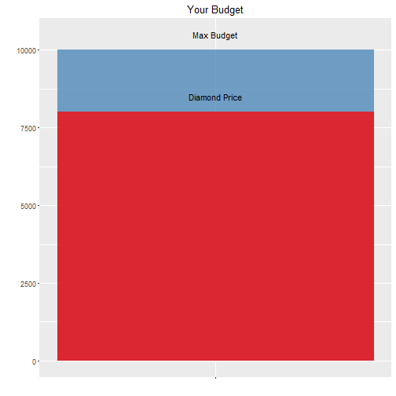

Need Help?
========================================================
 - Do you want to buy a new diamond?
 - Is your knowledge of diamonds lacking?
 - Do you want a fair price?
 - Do you want the shopping experience to be easy?

If you answered yes to any of these questions, this application can help you!
Read on!

The Perfect Diamond
========================================================

Ever heard of *"the 4 C's"*? We've created a model using "the 4 C's" of almost 54,000 diamonds so you can find your perfect diamond at your perfect price!

- Cut
- Clarity
- Color
- Carat

The Model
========================================================

Here is our model.... Seems confusing, right? Well, we have good news...


```r
price_model <- train(log(price) ~ cut + clarity + color + carat, data = diamonds, method = 'lm')
summary(price_model)
```

```

Call:
lm(formula = .outcome ~ ., data = dat)

Residuals:
    Min      1Q  Median      3Q     Max 
-5.9828 -0.2183  0.0576  0.2485  1.6301 

Coefficients:
              Estimate Std. Error  t value Pr(>|t|)    
(Intercept)  5.9227456  0.0040955 1446.142  < 2e-16 ***
cut.L        0.0552607  0.0059571    9.276  < 2e-16 ***
cut.Q       -0.0151744  0.0052469   -2.892  0.00383 ** 
cut.C        0.0225108  0.0045573    4.940 7.85e-07 ***
`cut^4`      0.0009450  0.0036496    0.259  0.79568    
clarity.L    0.7610924  0.0090320   84.266  < 2e-16 ***
clarity.Q   -0.3715090  0.0084449  -43.992  < 2e-16 ***
clarity.C    0.2181347  0.0072298   30.172  < 2e-16 ***
`clarity^4` -0.0708059  0.0057825  -12.245  < 2e-16 ***
`clarity^5`  0.0522089  0.0047192   11.063  < 2e-16 ***
`clarity^6`  0.0005195  0.0041121    0.126  0.89947    
`clarity^7`  0.0058041  0.0036277    1.600  0.10962    
color.L     -0.5056829  0.0051887  -97.459  < 2e-16 ***
color.Q     -0.1576930  0.0047226  -33.391  < 2e-16 ***
color.C     -0.0034591  0.0044148   -0.784  0.43333    
`color^4`    0.0395349  0.0040544    9.751  < 2e-16 ***
`color^5`   -0.0192071  0.0038307   -5.014 5.35e-07 ***
`color^6`    0.0041965  0.0034828    1.205  0.22823    
carat        2.1974591  0.0035253  623.348  < 2e-16 ***
---
Signif. codes:  0 '***' 0.001 '**' 0.01 '*' 0.05 '.' 0.1 ' ' 1

Residual standard error: 0.3389 on 53921 degrees of freedom
Multiple R-squared:  0.8885,	Adjusted R-squared:  0.8884 
F-statistic: 2.387e+04 on 18 and 53921 DF,  p-value: < 2.2e-16
```


Good News!
========================================================

The good new is that you don't need to care! Our app takes care of all the confusing stuff for you.

All you need to do is adjust the cut, clarity, color, and carat of the diamond. We'll tell you how much you can expect to pay for that diamond.

But that's not all!

Your Budget
========================================================

If you include your budget, we'll show you how the price of your diamond compares!


